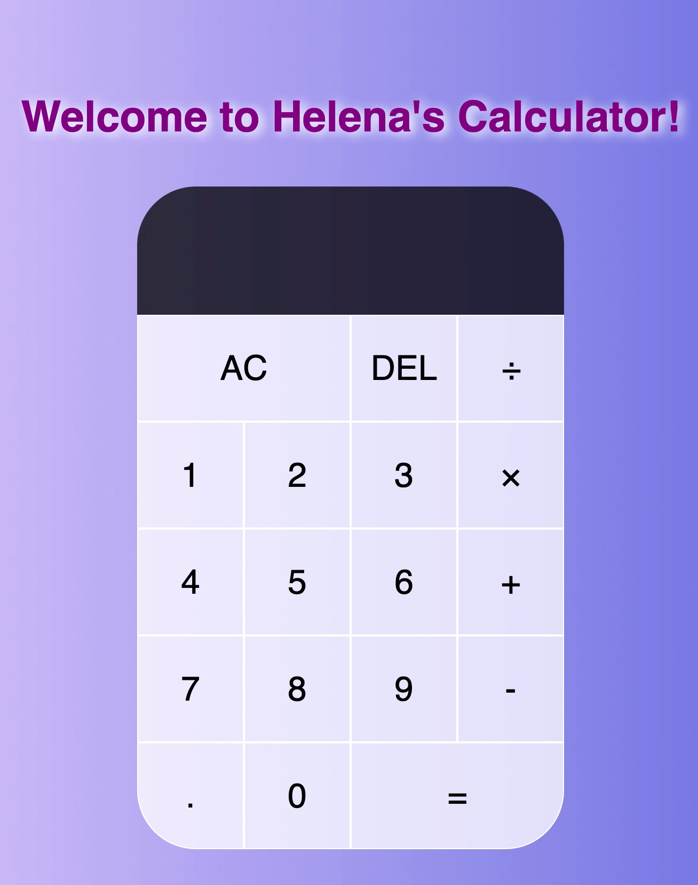

# Simple Calculator

Calculator created using HTML, CSS, and JavaScript. Worked with tools and concepts such as CSS Grid, Flexbox, OOP, and debugging edge cases. [Try it yourself!](https://helenaxu924.github.io/Simple-Calculator/)

 
 ## Demo 

Simple calculations without decimals:

Large calculations involving decimals, delete and clear keys: 

